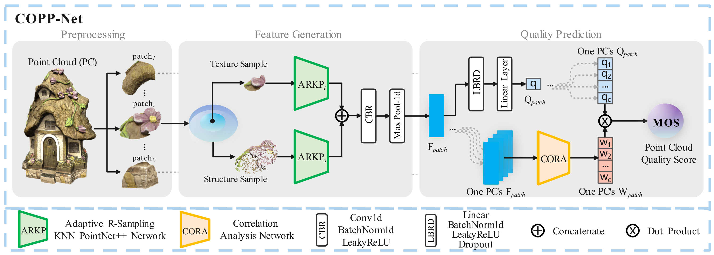
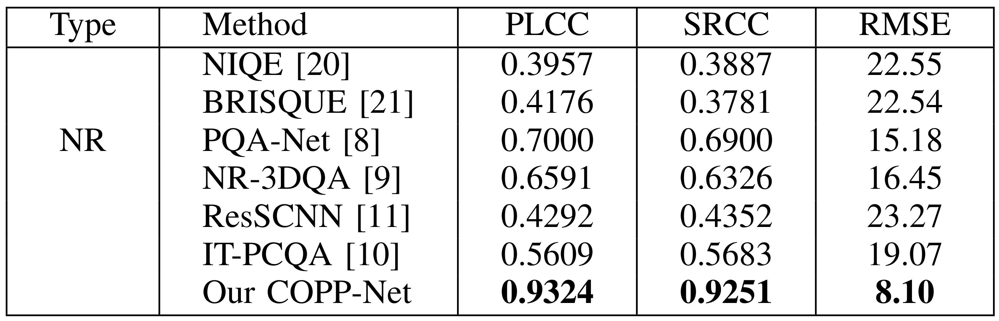

# COPP-Net

Paper: [No-Reference Point Cloud Quality Assessment via Weighted Patch Quality Prediction](https://arxiv.org/pdf/2305.07829.pdf)

</img>

This is the official implementation of **"No-Reference Point Cloud Quality Assessment via Weighted Patch Quality Prediction"**. It currently includes code for the point cloud quality assessment(PCQA).

## Introduction

> With the rapid development of 3D vision applications based on point clouds, point cloud quality assessment
> (PCQA) is becoming an important research topic. However, the prior PCQA methods ignore the effect of local quality variance across different areas of the point cloud. To take an advantage of the quality distribution imbalance, we propose a no-reference point cloud quality assessment (NR-PCQA) method with local area correlation analysis capability, denoted as COPP-Net. More specifically, we split a point cloud into patches, generate texture and structure features for each patch, and fuse them into patch features to predict patch quality. Then, we gather the features of all the patches of a point cloud for correlation analysis, to obtain the correlation weights. Finally, the predicted qualities and correlation weights for all the patches are used to derive the
> final quality score. Experimental results show that our method outperforms the state-of-the-art benchmark NR-PCQA methods. 

## Performance on WPC Datasets

</img>

## Running experiment

### 1. Download Code

Download this github repository to your computer, with the following folder structure:

​			:file_folder: code

​					:snake: 1.1pc_to_patch.py

​					:snake: 1.2patch_list_create.py

​					:snake: 1.3train_ARKP.py

​					:snake: 2.1patch_list_rank.py

​					:snake: 2.2train_CORA.py

​					:snake: data_load_mos.py

​					:snake: data_load_mos_corr.py

​					:snake: model_ARKP.py

​					:snake: model_CORA.py

​					:snake: util.py

​			:file_folder: data

​					:file_folder: WPC

​							:file_folder: Distortion_ply

​							:snake: rename_error_file.py

​							:1234: mos.xls

​							:1234: test.xls

​							:1234: train.xls

​			:file_folder: images

​			:newspaper: README.md

### 2. Data Preparation

Download the [WPC datasets](https://github.com/qdushl/Waterloo-Point-Cloud-Database) from [here](https://github.com/qdushl/Waterloo-Point-Cloud-Database), and copy all the distorted 740 ply files into `./data/WPC/Distortion_ply` folder. All files are in the same folder.

We have prepared the dataset segmentation file: `mos.xls`、`test.xls`、`train.xls`
Please use the `rename_error_file.py` file in the folder to check the Correct name of the point cloud file.

(The reason for doing this is that out of the 740 distorted files in the WPC database, 80 files contain incorrect

 `'_rounded'` end needs to be modified, otherwise it will not run correctly.)

### 3. Install Dependencies

Please install `CUDA` and `cudnn` in advance. Our code can only run on GPU at present. In addition, `Anaconda` is recommended. `Python >= 3.8` is required, and the Python libraries that need to be installed are as follows:

> torch
>
> tqdm
>
> xlrd
>
> argparse
>
> numpy
>
> pandas
>
> plyfile
>
> multiprocessing
>
> sklearn
>
> scipy
>
> open3d

The above Python libraries are sufficient as long as they do not conflict with each other and do not require specific versions.

### 4. Run Code

Run the code one by one to obtain the experimental results:

> 1.1pc_to_patch.py
>
> 1.2patch_list_create.py
>
> 1.3train_ARKP.py
>
> 2.1patch_list_rank.py
>
> 2.2train_CORA.py

##### Supplement

For experiments with other data sets and other experiment settings, please modify the relevant parameters.